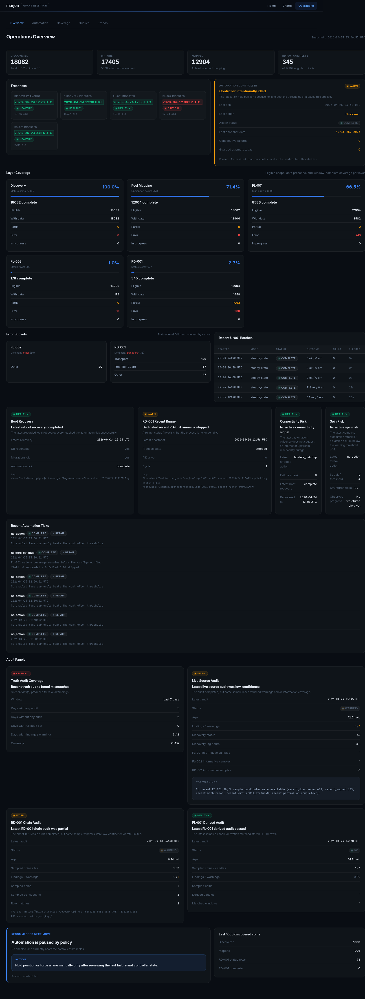
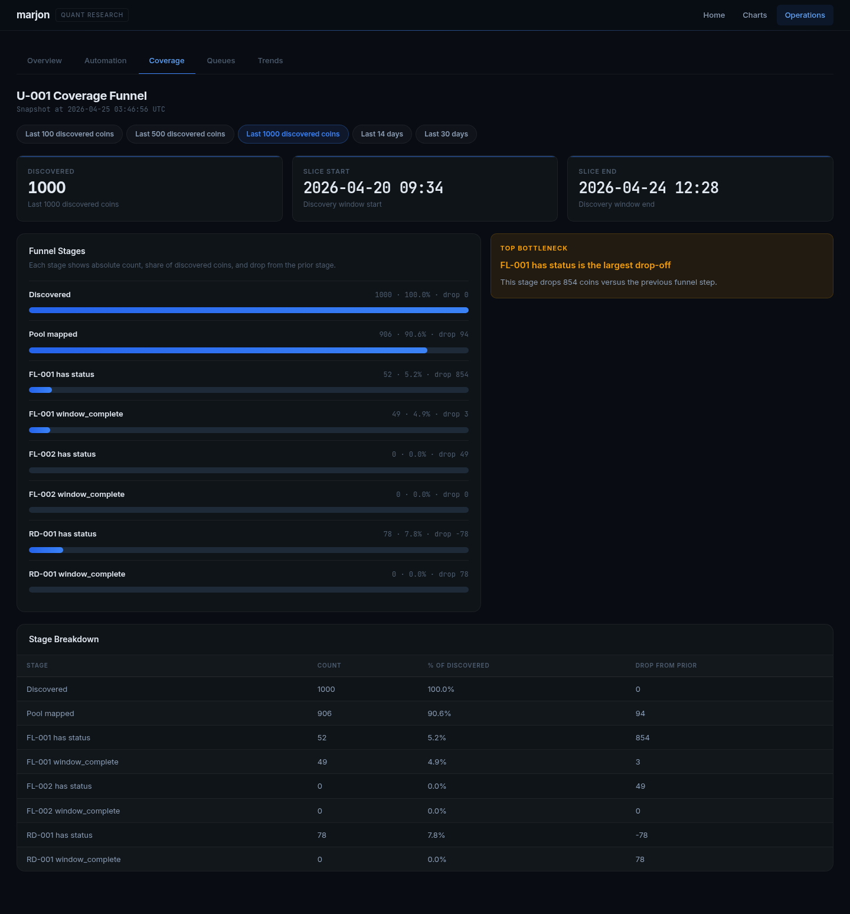
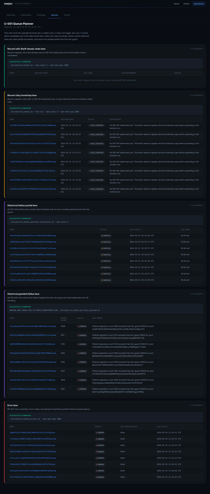

# marjon

Crypto quantitative research platform. Collects market and on-chain data, stores it in a structured warehouse with point-in-time semantics, and provides a data service for analysis and strategy development. Universe-agnostic by design.

## Why it matters

`marjon` is built for research workflows where raw market data is not enough. It keeps ingestion state, source audits, point-in-time access rules, derived feature checks, and strategy tooling in one Django-backed system so experiments can be traced back to the exact data available at the time.

## Highlights

- Market and on-chain warehouse for crypto research datasets
- Point-in-time data service for analysis without look-ahead leakage
- Provider-backed ingestion pipelines for OHLCV, holder snapshots, pool mapping, and transactions
- Direct audit paths for source freshness, Solana chain checks, and derived-candle parity
- Strategy research layer with backtesting, sweeps, and leaderboard commands
- Operational cockpit and command wrappers for local unattended runs

## Stack

- **Backend:** Django + PostgreSQL
- **Data sources:** GeckoTerminal, Moralis, Shyft, Helius, Binance, Solana RPC
- **Operations:** Docker Compose, Make, shell wrappers, Django management commands

## Architecture

```text
External providers
  -> pipeline connectors
  -> warehouse models
  -> data service / point-in-time access
  -> derived features and strategy engine
  -> ops dashboard and audit commands
```

## Public Demo Status

This repository is currently a local-first research platform. The codebase includes an ops UI and Django views, but no public hosted demo is linked yet because provider keys and local warehouse state are required for meaningful output.

## Screenshots

Screenshots are captured from a local warehouse state and are intended to show the operational surfaces, not a hosted public demo.

### Operations Overview



### Coverage Funnel



### Queue Planner



## Roadmap

| Phase | What it delivers |
|-------|-----------------|
| **1** | Django models + empty warehouse tables |
| **2** | FL-001 pipeline — OHLCV data flowing in |
| **3** | FL-002 pipeline — holder snapshot data flowing in |
| **4** | Data service with point-in-time enforcement |
| **5** | Derived features + first analysis |
| **6** | Strategy specification + backtesting |
| **7** | Execution layer |

## Setup

Bootstrap the local environment with the repo script:

```bash
./scripts/bootstrap.sh
```

That script will:

- create `.env` from `.env.example` if needed
- create a virtualenv if neither `.venv` nor `venv` exists
- install `requirements.txt`
- start the PostgreSQL container
- run migrations

Daily commands then go through the shared wrapper:

```bash
./scripts/doctor.sh
./scripts/manage.sh runserver
./scripts/test.sh
./scripts/manage.sh u001_ingestion_health
./scripts/manage.sh repair_u001_ingestion --dry-run
```

There is also a `Makefile` wrapper if you prefer:

```bash
make bootstrap
make doctor
make u001-health
make u001-audit
make u001-audit-sources
make u001-rd001-chain-audit
make u001-fl001-derived-audit
make u001-holders
make u001-rd001-errors
make u001-rd001-partials
make u001-rd001-partials-historical
make u001-rd001-partials-guarded
make u001-automation
make u001-snapshot
make u001-recover-after-reboot
make u001-repair
make install-hooks
make test
make runserver
```

The scripts prefer `.venv` when both `.venv` and `venv` exist, which avoids the drift that can happen when different entrypoints activate different environments.

To install the tracked git hooks for this checkout:

```bash
./scripts/install-hooks.sh
```

That configures `core.hooksPath` to use `.githooks/`, so the pre-commit hook is versioned with the repo instead of living only in `.git/hooks/`.

For live U-001 pipeline state, use:

```bash
make u001-health
make u001-audit
```

That reports freshness, per-layer coverage, stale `in_progress` rows, free-tier-guarded RD-001 statuses, common upstream errors, and recent U-001 batch activity using the actual database contents.

For unattended-safety checks, use:

```bash
./scripts/manage.sh audit_u001
make u001-audit
```

That audits whether U-001 is presently safe to leave unattended based on discovery freshness, automation freshness, snapshot freshness, controller failure state, current auth/transport residue, and coverage floors. It also states explicitly that it does not perform an external-provider truth reconciliation.
It now also reports the latest complete-lane streak and warns when automation appears to be spinning on one lane, including consecutive `rd001_recent` ticks that complete without loading any rows, `holders_catchup` ticks that only skip work, and `pool_mapping_recent` ticks that fail to map any recent coins once structured tick-yield summaries are available.
It also now surfaces the latest persisted reboot-recovery result, so a failed first post-boot automation tick is visible from the unattended audit instead of only from shell logs or the cockpit.
It now also checks the dedicated recent-window RD-001 runner heartbeat file, so unattended safety reports when that separate loop is missing, stale, dead, or alive but backing off after a failed recent cycle.
It also now evaluates the latest persisted `audit_u001_rd001_chain` run, so stale or warning/finding-producing direct-RPC RD-001 chain audits show up in unattended safety alongside the live provider-source audit.
It also now evaluates the latest persisted `audit_u001_fl001_derived` run, so stale or warning/finding-producing self-derived FL-001 candle audits show up there too.
It now also summarizes recent Phase 0 truth-audit coverage over a configurable trailing window and warns when too few recent days had any truth-audit activity.
It also now classifies likely internet or upstream reachability failures from recent automation evidence, so “PC is on but network-dependent lanes are blocked” shows up explicitly instead of looking like a generic controller failure.

For live sampled source comparisons, use:

```bash
./scripts/manage.sh audit_u001_sources
make u001-audit-sources
```

That command performs live upstream fetches and compares sampled source data against the warehouse:
- discovery freshness against Moralis page 1
- FL-001 candle timestamp parity against GeckoTerminal
- FL-002 holder timestamp parity against Moralis
- recent RD-001 signature parity against Shyft

The default audit is intentionally low-budget: `1` sample each for FL-001, FL-002, and recent RD-001, with shorter FL-002 / RD-001 windows so it is safe to run routinely. Each run is now persisted and surfaced on `/ops/u001/` under `Live Source Audit`.

It is intentionally separate from `audit_u001`, because it still consumes provider budget and acts as a sampled external-truth check rather than a scheduler-safety check.

For direct sampled RD-001 chain checks, use:

```bash
./scripts/manage.sh audit_u001_rd001_chain
make u001-rd001-chain-audit
```

This command does not treat Shyft or Helius as truth. It fetches sampled transaction signatures directly from Solana RPC and compares stored RD-001 rows against chain-native transaction data. It now does two checks:
- sampled row-level validation for signature existence, success status, block time, tx fee, fee payer, and, when pool-owner token balance metadata is available, trade side and token amount
- sampled pool-window reconciliation for missing or extra trade signatures over the same time window

Public Solana RPC can rate-limit the window scan. That now degrades to a persisted warning instead of failing the whole audit run. Each run is now persisted as `U001RD001ChainAuditRun`.

For low-budget Solscan parser spot checks, use:

```bash
./scripts/manage.sh audit_u001_rd001_solscan
make u001-rd001-solscan-audit
```

This is intentionally a secondary heuristic check, not chain truth. It samples recent RD-001 rows, compares them against Solscan transaction detail payloads, and also compares a short recent warehouse signature window against Solscan account transactions for the pool address. It requires `SOLSCAN_API_KEY`.

For this audit path, configure a dedicated keyed RPC when possible:

```bash
U001_CHAIN_AUDIT_RPC_URL=https://your-keyed-rpc.example.com
```

Resolution order is:
- `U001_CHAIN_AUDIT_RPC_URL`
- `MARJON_U001_CHAIN_AUDIT_RPC_URL`
- `SOLANA_RPC_URL`
- `MARJON_SOLANA_RPC_URL`
- `HELIUS_API_KEY_1`-derived RPC URL
- public Solana RPC fallback

`./scripts/doctor.sh` now warns when the chain audit would still use the public fallback.

For derived FL-001 checks, use:

```bash
./scripts/manage.sh audit_u001_fl001_derived
make u001-fl001-derived-audit
```

This command derives U-001 FL-001 candles from warehouse RD-001 trades plus local `SOLUSDT` candles from U-002, then compares those derived candles against stored U-001 FL-001 rows. It is the first self-derived candle truth path in the repo. The current version requires local `SOLUSDT` coverage for the sampled window, so it will deliberately choose sample windows that overlap the available U-002 history.

To persist a daily exact-count snapshot for the trends page, use:

```bash
./scripts/manage.sh snapshot_u001_ops
make u001-snapshot
```

To run one policy-driven U-001 automation tick, use:

```bash
./scripts/manage.sh automate_u001 --dry-run
./scripts/run_u001_automation.sh
make u001-automation
```

The controller now has a dedicated recent pool-mapping catch-up lane:
- if discovery is stale, it still selects `refresh_core`
- if discovery is fresh but recent mapping is weak, it can select `pool_mapping_recent`
- once recent mapping exists, recent RD-001 bootstrap work can win before FL-002 backlog catch-up because the Shyft retention window is time-sensitive
- if recent-focused automation runs for several consecutive successful ticks while FL-002 remains below floor, the controller will force a `holders_catchup` tick so holders coverage cannot be starved indefinitely
- when core ingestion lanes are not more urgent, the controller can now also schedule the low-budget Phase 0 truth audits directly:
  `audit_u001_sources`, `audit_u001_rd001_chain`, and `audit_u001_fl001_derived`
- when recent automation failures look like internet or upstream reachability trouble, the controller now pauses sooner on that specific condition instead of spending several more failing ticks rediscovering the same outage
- persisted automation ticks now keep structured result summaries for batch-driven lanes, so the cockpit can show whether a “complete” RD-001 tick actually loaded rows and how many API calls it spent
- repeated `holders_catchup` ticks that load `0` rows now trigger a temporary holders no-progress pause in the main controller, so it can stop spinning on an unproductive lane and move to other work
- automation now treats RD-001 batch lanes as failed when they queue work but every queued coin fails with `0` rows loaded, so outage-driven no-progress batches are no longer recorded as successful ticks

If you want the rolling recent RD-001 window to run separately and continuously, use:

```bash
./scripts/manage.sh run_u001_rd001_recent_cycle
./scripts/run_u001_rd001_recent_continuous.sh
make u001-rd001-recent-cycle
make u001-rd001-recent-continuous
```

That separate runner is deliberately narrower than the main controller. Each cycle does:
- stale-state repair
- recent `RD-001` batch ingestion against a bounded recent candidate set, using only coins that already have pool mappings

When that dedicated recent runner is healthy and fresh, the main U-001 controller now defers `rd001_recent` and leaves the rolling Shyft window to the separate loop.
While that recent runner remains healthy, the main controller now also prioritizes historical `RD-001` catch-up lanes (`rd001_partial_historical`, due `rd001_error_recovery`, and guarded recovery) ahead of lower-urgency holders and truth-audit work, so freed automation capacity goes into backlog reduction instead of competing with the recent loop.
The default historical-partial cooldown is now short enough for each 30-minute main-controller tick to stay on regular RD-001 partial catch-up, and guarded rows no longer interrupt that path while normal partial/error backlog still exists.
`rd001_error_recovery` is now explicitly Helius-backed too, so those controller ticks target the real historical error backlog instead of the small recent Shyft subset.
Historical Helius `partial` and `error` queues now also prefer coins with smaller existing raw histories first, so the controller spends recovery slices on cheaper rows that are more likely to close into `window_complete` instead of immediately burning budget on very large windows.
The guarded Helius lane now uses its own raised filtered-signature limit (`MARJON_U001_RD001_GUARDED_MAX_FILTERED_SIGNATURES`, default `1400`) and skips guarded rows still above that threshold, so the automation controller only spends guarded budget on retries that have a chance to succeed.

Tune the shell wrapper with:
- `MARJON_U001_RD001_CONTINUOUS_SLEEP_SECONDS`
- `MARJON_U001_RD001_CONTINUOUS_ERROR_SLEEP_SECONDS`
- `MARJON_U001_RD001_CONTINUOUS_MAX_CYCLES`

The aggressive recent-runner defaults are now:
- no success sleep between cycles (`MARJON_U001_RD001_CONTINUOUS_SLEEP_SECONDS=0`)
- `rd001-workers=4`
- `rd001-parse-workers=4`
- Shyft parse batch size `100`
- no first-page signature skip caps in `fetch_transactions_batch` (`MARJON_U001_RD001_MAX_NEW_SIGS=0`, `MARJON_U001_RD001_MAX_BOOTSTRAP_NEW_SIGS=0`)
- no connector-level filtered-signature guard by default (`MARJON_U001_RD001_MAX_FILTERED_SIGNATURES=0`)

Those settings are intended to fan recent Shyft work out across the validated Shyft key pool instead of running one mostly-serial parse stream.

The dedicated recent cycle also now caps Phase 1 signature discovery with `--rd001-candidate-limit` (default `150`), so the rolling recent lane no longer scans the full recent mapped universe on every loop before narrowing to its per-cycle work queue.
Within that bounded recent slice, coins with existing RD-001 raw history are now considered first, so the continuous runner prefers steady-state watermark maintenance before spending discovery budget on raw bootstrap names.
The continuous recent runner no longer performs pool mapping itself. Daily `refresh_core` and the main controller own discovery and mapping; the recent runner simply skips unmapped coins and keeps already-mapped recent pools hot.

For better reboot behavior on a local machine, use:

```bash
./scripts/recover_after_reboot.sh
make u001-recover-after-reboot
```

That boot-time wrapper:
- waits for Docker to become ready
- brings the `db` container back up
- waits for PostgreSQL on `localhost:5433`
- runs migrations
- triggers one immediate U-001 automation tick
- launches the separate recent-window RD-001 continuous runner by default

If you want this to happen automatically after a reboot, add this cron entry:

```bash
@reboot /home/beck/Desktop/projects/marjon/scripts/recover_after_reboot.sh
```

This does not replay the hours or days when the machine was off, but it does let the local system resume from stored warehouse state without waiting for the next manual intervention. The PostgreSQL container is also now configured with `restart: unless-stopped`, so Docker will try to bring it back automatically once the daemon itself is running.

If you need the reboot flow without starting the separate recent RD-001 loop, set:

```bash
MARJON_BOOT_START_RD001_CONTINUOUS=0 ./scripts/recover_after_reboot.sh
```

Each reboot recovery is now also persisted in the warehouse and surfaced on `/ops/u001/`, so the cockpit can show whether the latest post-boot recovery actually reached the first automation tick or failed after DB startup.

There is now also a browser-facing cockpit surface for the same operational state at:

```bash
/ops/u001/
```

The current pages are:

- `/ops/u001/` for overview, freshness, layer coverage, automation controller state, boot recovery status, automation spin-risk, error buckets, and a next-action panel derived from the same policy engine the controller uses
  It also now shows the most recent persisted automation ticks, so controller behavior is visible over time instead of only through the singleton state row.
  It also now includes both `Live Source Audit` and `RD-001 Chain Audit`, so provider-sampled checks and direct-RPC sampled truth checks are visible side by side.
  It also now includes `FL-001 Derived Audit`, so self-derived candle checks from warehouse RD-001 plus local `SOLUSDT` are visible beside the other Phase 0 truth surfaces.
  It also now includes a compact `Truth Audit Coverage` summary for the last 7 days, so missing Phase 0 audit coverage is visible without opening trends.
  It also now includes `Connectivity Risk`, so recent transport/reachability failure streaks show up as a distinct operator signal rather than generic automation failure pressure.
- `/ops/u001/automation/` for filtered controller history, including action/status rollups, the persisted tick log, and a spin-risk panel that mirrors the unattended audit’s latest-lane streak logic
  It also shows the manual command equivalent for the controller's current decision and for each recorded tick.
  It also now includes `Truth Audit Lanes`, so you can see whether automation has actually been running the Phase 0 audit lanes and what the latest persisted audit result currently says for each one.
  It also now includes `Connectivity Risk`, so likely internet/upstream reachability trouble is visible on the same page as the automation tick log.
- `/ops/u001/coverage/` for the recent-cohort funnel and bottleneck callout
- `/ops/u001/queues/` for the read-only RD-001 queue planner and suggested commands
- `/ops/u001/coin/<mint>/` for full single-coin debug context, including layer status, run history, counts, and timeline
- `/ops/u001/trends/` for current operational pressure plus exact daily snapshot rows when available
  It now also includes current `Live Source Audit`, `RD-001 Chain Audit`, and `FL-001 Derived Audit` cards plus daily truth-audit history and coverage summaries, so Phase 0 confidence gaps are visible over time instead of only as latest-state on the overview.

The tracked operational backlog for U-001 lives in [CHECKLIST.md](CHECKLIST.md), so current ingestion follow-up work stays in the repo instead of only in chat.

If U-001 ingestion is interrupted and leaves stale `started` or `in_progress` rows behind, use:

```bash
./scripts/manage.sh repair_u001_ingestion --dry-run
make u001-repair
```

RD-001 defaults are intentionally conservative for free-tier usage. You can tune them with:

```bash
MARJON_U001_DAILY_STEPS
MARJON_U001_DAILY_COINS
MARJON_U001_DAILY_DAYS
MARJON_U001_DAILY_MATURE_ONLY
MARJON_U001_ENABLE_HOLDERS
MARJON_U001_HOLDERS_COINS
MARJON_U001_HOLDERS_DAYS
MARJON_U001_HOLDERS_MATURE_ONLY
MARJON_U001_RD001_MAX_COINS
MARJON_U001_RD001_ERROR_MAX_COINS
MARJON_U001_RD001_PARTIAL_MAX_COINS
MARJON_U001_RD001_PARTIAL_HIST_MAX_COINS
MARJON_U001_RD001_PARTIAL_GUARDED_MAX_COINS
MARJON_U001_RD001_MAX_NEW_SIGS
MARJON_U001_RD001_MAX_BOOTSTRAP_NEW_SIGS
MARJON_U001_RD001_MAX_FILTERED_SIGNATURES
MARJON_U001_RD001_BATCH_WORKERS
MARJON_U001_RD001_PARSE_WORKERS
MARJON_U001_RD001_PARSE_BATCH_SIZE
MARJON_U001_RD001_RPC_BATCH_SIZE
MARJON_U001_RD001_MIN_SIGS
MARJON_U001_RD001_MIN_STEADY_STATE_SIGS
MARJON_U001_RD001_SLEEP
MORALIS_DAILY_CU_LIMIT
```

The tracked wrappers default to a free-tier-safe posture:

- [run_daily.sh](scripts/run_daily.sh) processes a capped recent slice and skips holders unless `MARJON_U001_ENABLE_HOLDERS=1`.
- [run_daily.sh](scripts/run_daily.sh) also prefers mature coins by default so OHLCV backfill does not waste its capped slice on immature names.
- [run_holders.sh](scripts/run_holders.sh) is the dedicated low-budget FL-002 catch-up path for mature coins.
- [run_batch.sh](scripts/run_batch.sh) caps RD-001 work per run and keeps concurrency conservative.
- [run_batch_errors.sh](scripts/run_batch_errors.sh) spends RD-001 budget specifically on coins already in `error` state.
- [run_batch_partials.sh](scripts/run_batch_partials.sh) spends RD-001 budget specifically on coins stuck in `partial` state.
- [run_batch_partials_historical.sh](scripts/run_batch_partials_historical.sh) spends a small Helius budget on old RD-001 `partial` rows that are outside Shyft retention.
- Historical RD-001 `partial` and `error` retries now skip rows already marked by the free-tier guard unless you pass `--include-free-tier-guarded`.
- [run_batch_partials_guarded.sh](scripts/run_batch_partials_guarded.sh) is the explicit opt-in lane for those free-tier-guarded historical `partial` rows, with a tiny default slice.
- [run_u001_automation.sh](scripts/run_u001_automation.sh) runs one overlap-protected policy tick that repairs stale state, selects one U-001 lane, executes it, and snapshots when due.

The shared HTTP client also disables HTTP/2 for Shyft by default because RD-001 showed repeated transport instability there in live runs. Override the host list with `MARJON_HTTP2_DISABLED_HOSTS` if you need different behavior.

## Releases

The repo now tracks release notes in [CHANGELOG.md](CHANGELOG.md) and the current release number in [VERSION](VERSION).

Recommended release flow:

1. Add new notes under `Unreleased` in [CHANGELOG.md](CHANGELOG.md).
2. When you are ready to publish, move those notes into a new `X.Y.Z` section and update [VERSION](VERSION).
3. Commit the release prep.
4. Tag the release commit with `git tag -a vX.Y.Z -m "Release vX.Y.Z"`.
5. Push the branch and tag, then paste the matching changelog section into the GitHub release body.

Current release line: `v0.4.0`.

## License

MIT. See [LICENSE](LICENSE).
